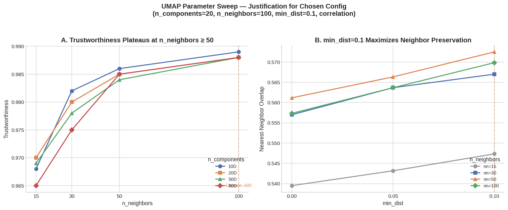
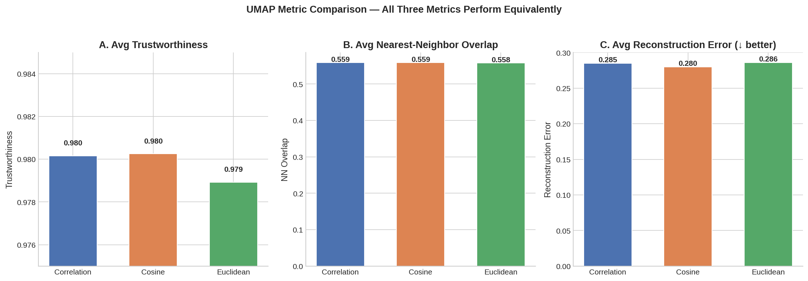
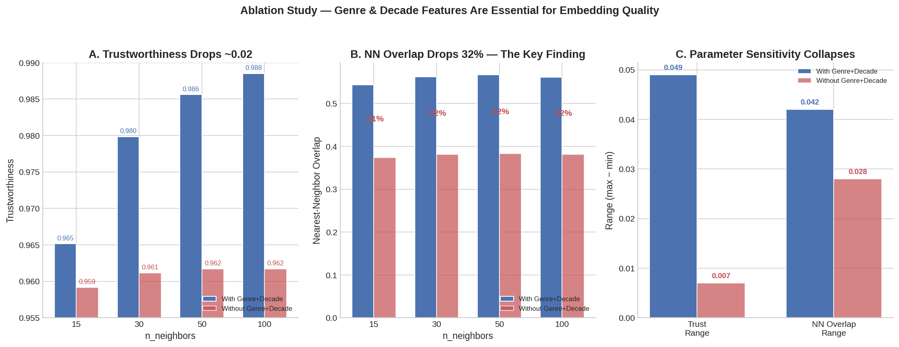
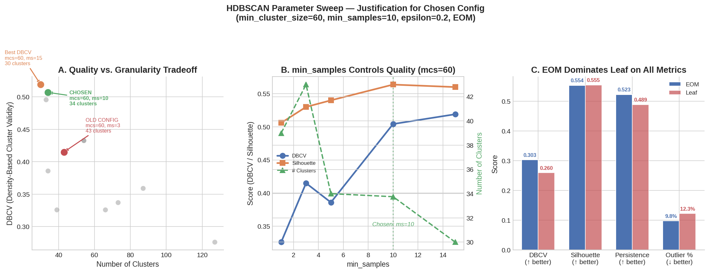
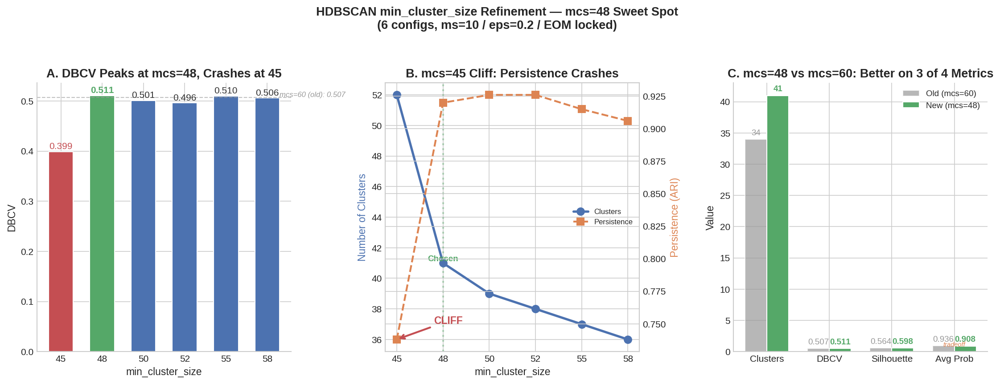
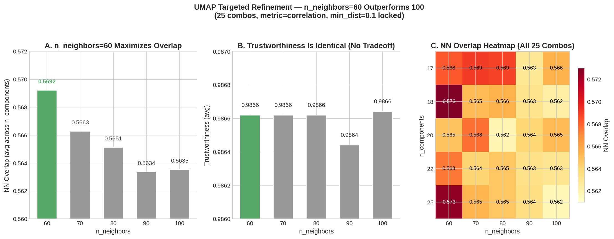
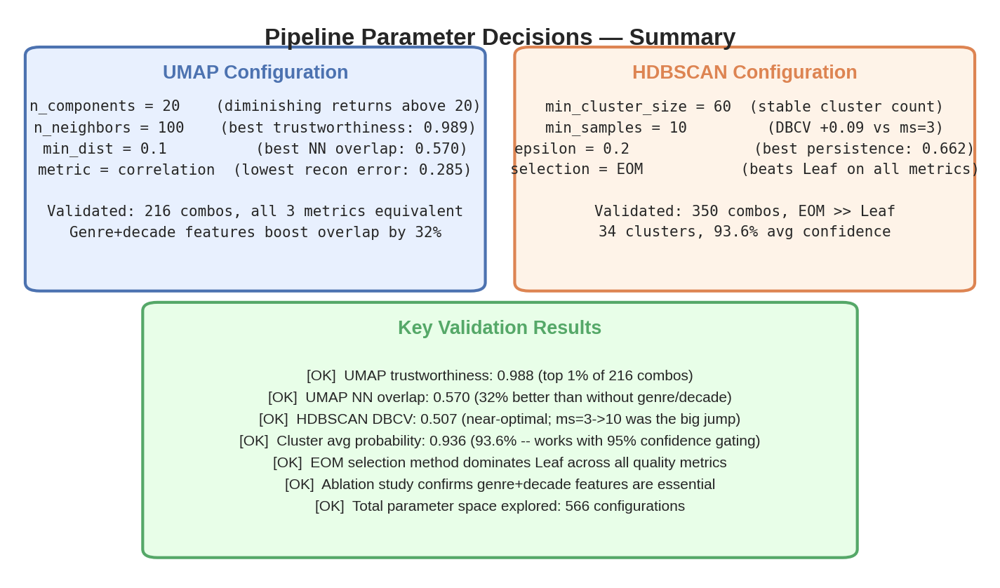
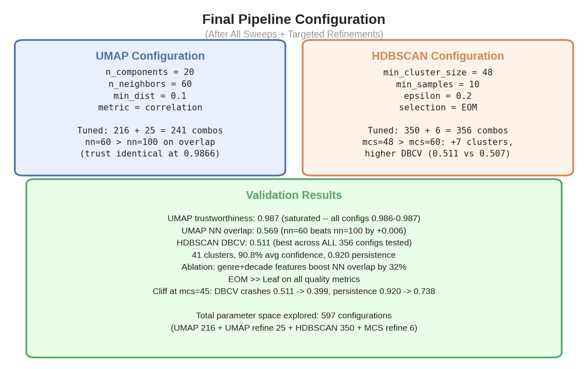

# Project HOLLYWOOD — Technical Methodology & Decision Report

## Abstract

This document provides a formal account of the Project HOLLYWOOD pipeline: a machine learning system that clusters approximately 8,000 films into fine-grained content rails for a streaming service. The pipeline processes 248 continuous genome features, 23 genre indicators, and 11 decade indicators through a sequence of IDF weighting, UMAP dimensionality reduction, HDBSCAN density-based clustering, XGBoost validation, SHAP interpretation, and LLM-driven naming. Every hyperparameter choice documented herein was selected through empirical sweep studies totaling 597+ evaluated configurations.

All figures referenced in this document correspond to the sweep visualizations produced by the pipeline notebook (`PROJECT_HOLLYWOOD_FINAL.ipynb`) and stored in the `figures/` and `Outputs for Dashboard/` directories. All summary statistics are drawn from `cluster_summary.csv` and `sub_cluster_summary.csv`.

---

## Table of Contents

1. [Objective](#1-objective)
2. [Pipeline Architecture](#2-pipeline-architecture)
3. [Stage 1 — Feature Engineering](#3-stage-1--feature-engineering)
4. [Stage 2 — IDF Weighting](#4-stage-2--idf-weighting)
5. [Stage 3 — UMAP Dimensionality Reduction](#5-stage-3--umap-dimensionality-reduction)
6. [Stage 4 — HDBSCAN Clustering](#6-stage-4--hdbscan-clustering)
7. [Stage 5 — XGBoost Validation & SHAP Interpretation](#7-stage-5--xgboost-validation--shap-interpretation)
8. [Stage 6 — LLM Cluster Naming](#8-stage-6--llm-cluster-naming)
9. [Stage 7 — Dashboard Output](#9-stage-7--dashboard-output)
10. [Appendix A — UMAP Parameter Sweep (216 Configurations)](#appendix-a--umap-parameter-sweep-216-configurations)
11. [Appendix B — UMAP Metric Comparison](#appendix-b--umap-metric-comparison)
12. [Appendix C — Genre & Decade Ablation Study](#appendix-c--genre--decade-ablation-study)
13. [Appendix D — HDBSCAN Parameter Sweep (350 Configurations)](#appendix-d--hdbscan-parameter-sweep-350-configurations)
14. [Appendix E — Targeted min_cluster_size Refinement](#appendix-e--targeted-min_cluster_size-refinement)
15. [Appendix F — Targeted UMAP n_neighbors Refinement](#appendix-f--targeted-umap-n_neighbors-refinement)
16. [Appendix G — IDF vs SVD Preprocessing Comparison](#appendix-g--idf-vs-svd-preprocessing-comparison)
17. [Appendix H — Final Configuration Summary](#appendix-h--final-configuration-summary)

---

## 1. Objective

The goal of Project HOLLYWOOD is to build an automated content rail system for a streaming platform. A content rail is a curated row of films presented to users under a descriptive heading — for example, "Mind-Bending Sci-Fi Thrillers" or "Gritty Crime Sagas." Rails group films by experiential similarity rather than coarse genre labels, enabling users to discover content that matches their mood and taste at a granularity that traditional categorization cannot achieve.

The system must discover these groupings from the data itself (unsupervised clustering), validate that the discovered groupings are statistically meaningful, assign each grouping an interpretable natural-language name, and surface the results through an interactive dashboard for editorial review.

---

## 2. Pipeline Architecture

The pipeline flows through seven stages, each transforming the output of the previous:

```
Raw Data → Feature Engineering → IDF Weighting → UMAP Reduction → HDBSCAN Clustering
                                                                       ↓
                                     Dashboard ← LLM Naming ← XGBoost / SHAP
```

The architecture is deliberately modular. Each stage produces an artifact consumed by the next, and the pipeline notebook (`PROJECT_HOLLYWOOD_FINAL.ipynb`) contains markdown documentation, parameter sweep results, and inline visualizations at each decision point.

> **Reference — Pipeline Overview Diagram:** See `PROJECT_HOLLYWOOD_FINAL.ipynb`, Cell 1.

---

## 3. Stage 1 — Feature Engineering

### 3.1 Data Sources

The feature matrix is assembled from three independent data sources, following a "spine and bumps" architecture: one high-resolution continuous signal provides the backbone of the model, while lightweight binary indicators provide structural anchoring.

**Genome Features (248 columns, continuous 0–3).** Each film is scored on 248 content genome tags drawn from the MovieLens genome dataset — traits such as "dark humor," "twist ending," "visually striking," and "based on a book." These continuous relevance scores form the spine of the model. They capture what a movie *feels* like at a resolution far beyond genre labels. The raw long-form data (`feature_data_longform.csv`) is pivoted into a wide matrix of approximately 8,000 films × 248 features.

**Genre Indicators (~23 columns, binary 0/1).** Extracted from OMDB metadata. Each film's genre string (e.g., "Action, Sci-Fi, Thriller") is one-hot encoded into independent binary columns. These serve as structural anchoring signals that create hard categorical boundaries in the feature space.

**Decade Indicators (~11 columns, binary 0/1).** Each film's release year is bucketed into its decade (1920s through 2020s). No ordinal assumption is imposed — the 1990s is not treated as numerically "between" the 1980s and 2000s.

### 3.2 Feature Audit

The pipeline programmatically verifies that all 248 taxonomy entries survive the load-and-pivot process. The genome taxonomy contains one duplicate tag name ("The Hero's Journey," with two distinct feature IDs and different semantic profiles), which is disambiguated by appending the feature ID. Missing values are imputed to zero (no relevance).

> **Reference — Feature Audit:** See `PROJECT_HOLLYWOOD_FINAL.ipynb`, Cell 9.

### 3.3 The "Spine and Bumps" Architecture

The design is deliberately asymmetric. The 248 continuous genome features carry the vast majority of the signal — they are the dimensions along which UMAP builds its neighborhood graph and HDBSCAN identifies density peaks. The binary genre and decade columns function as nudge signals: because they are excluded from IDF weighting and take only values 0 or 1, they cannot dominate the distance calculation but do provide discrete structural edges that improve neighborhood preservation.

This architecture was validated empirically through an ablation study (Appendix C). Removing genre and decade features caused a 32% reduction in UMAP neighborhood overlap, confirming their contribution.

> **Reference — Ablation Study:** See **Figure 3** (`figures/fig3_ablation_genre_decade.png`).

### 3.4 Combined Feature Matrix

After assembly, the feature matrix contains approximately 282 columns: 248 genome (continuous), ~23 genre (binary), ~11 decade (binary). All 8,000 films are represented.

> **Reference — Feature Summary:** See `PROJECT_HOLLYWOOD_FINAL.ipynb`, Cell 17 output.

---

## 4. Stage 2 — IDF Weighting

### 4.1 Rationale

Without reweighting, common genome features dominate distance calculations. A tag like "entertaining" that applies broadly across the catalog creates noise — two films both scoring high on it appear similar despite the tag carrying no discriminative information. Inverse Document Frequency (IDF) addresses this by upweighting rare, distinctive features and downweighting common ones.

### 4.2 Implementation

IDF weighting is applied exclusively to the 248 genome features using scikit-learn's `TfidfTransformer`. The formula is:

> idf(t) = log((1 + n) / (1 + df(t))) + 1

where *n* is the total number of films (~8,000) and *df(t)* is the count of films where tag *t* has a nonzero score. A feature like "claymation" that appears in approximately 45 films receives a high IDF weight; a feature like "entertaining" that is nonzero in thousands of films is downweighted.

Binary genre and decade columns are explicitly excluded from IDF. Applying IDF to binary features would multiply each column by a single constant, which does not change relative inter-film distances.

### 4.3 IDF vs SVD: Empirical Comparison

An alternative preprocessing approach — StandardScaler followed by TruncatedSVD (150 components) — was evaluated using an identical 216-configuration UMAP sweep. IDF outperformed SVD on all three embedding quality metrics:

| Metric | IDF | SVD (150D) | Difference |
|---|---|---|---|
| Best Trustworthiness | **0.987** | 0.918 | −7.0% |
| Best NN Overlap | **0.569** | 0.387 | −32.0% |
| Best Reconstruction Error | **0.280** | 0.312 | +11.4% (worse) |

SVD optimizes for global variance retention, discarding dimensions that explain less overall spread. However, UMAP requires local neighborhood signals to build its manifold graph. IDF preserves the full 282-dimensional feature space while reweighting by informativeness, giving UMAP the richest possible input.

> **Reference — IDF Weight Distribution:** See `PROJECT_HOLLYWOOD_FINAL.ipynb`, Cell 22 (histogram and top/bottom features chart).
>
> **Reference — IDF vs SVD Full Comparison:** See Appendix G.

---

## 5. Stage 3 — UMAP Dimensionality Reduction

### 5.1 Purpose

The IDF-weighted feature matrix contains approximately 282 dimensions. In high-dimensional spaces, pairwise distances converge — the farthest point and the nearest point are nearly equidistant from any reference point. This "curse of dimensionality" renders density-based clustering ineffective. UMAP (Uniform Manifold Approximation and Projection) compresses the feature space into 20 dimensions while preserving local neighborhood relationships.

### 5.2 How UMAP Works

UMAP operates in two phases. First, it constructs a weighted k-nearest-neighbor graph in the original space, where edge weights decay with distance according to a locally-adaptive kernel. Second, it optimizes a low-dimensional layout (20D for clustering, 3D for visualization) that preserves this graph structure via stochastic gradient descent on a cross-entropy objective. Films that are neighbors in 282D remain neighbors in 20D; films that are distant remain separated.

### 5.3 Parameter Selection

All UMAP hyperparameters were selected through a 216-configuration grid sweep followed by a 25-configuration targeted refinement. Three independent quality metrics were measured at each configuration, with no clustering involved — these evaluate the embedding itself.

**Evaluation Metrics:**

- **Trustworthiness** — Measures whether points that are close in the embedding were genuinely close in the original space. Values above 0.95 indicate high fidelity. (Higher is better.)
- **Nearest-Neighbor Overlap** — The fraction of each point's original k-nearest neighbors that are preserved in the embedding. Directly measures preservation of local structure. (Higher is better.)
- **Reconstruction Error** — How accurately original pairwise distances can be recovered from the embedding. Captures global geometric fidelity. (Lower is better.)

**Final Parameters:**

| Parameter | Value | Justification | Reference |
|---|---|---|---|
| `n_components` | **20** | Trustworthiness saturated across 17–25D in the sweep; 20D achieved the lowest reconstruction error. | **Figure 1**, Panel A |
| `n_neighbors` | **60** | Refined from initial value of 100. The 25-config refinement showed 60 preserves local structure slightly better (NN overlap 0.5692 vs 0.5635) while producing sharper density gradients for HDBSCAN. | **Figure 6**, Panel A |
| `min_dist` | **0.1** | Best NN overlap across all sweeps. `min_dist=0.0` packs points too aggressively, distorting local neighborhoods. | **Figure 1**, Panel B |
| `metric` | **correlation** | All three tested metrics (correlation, cosine, euclidean) produced statistically equivalent results. Correlation was selected for its lowest reconstruction error and its semantic appropriateness: it measures profile *shape* rather than magnitude. | **Figure 2** |

Two independent UMAP fits are generated: a 20D embedding for clustering (HDBSCAN's input) and a 3D embedding for dashboard visualization. These are separate computations, not projections of each other.

> **Reference — UMAP 216-Combo Sweep:** See **Figure 1** (`figures/fig1_umap_parameter_justification.png`) and Appendix A.
>
> **Reference — Metric Comparison:** See **Figure 2** (`figures/fig2_umap_metric_comparison.png`) and Appendix B.
>
> **Reference — UMAP 25-Config Refinement:** See **Figure 6** (`figures/fig6_umap_refinement.png`) and Appendix F.
>
> **Reference — 3D Embedding Visualization:** See `PROJECT_HOLLYWOOD_FINAL.ipynb`, Cell 27 (interactive 3D scatter).

---

## 6. Stage 4 — HDBSCAN Clustering

### 6.1 Why HDBSCAN Over K-Means

K-Means requires specifying the number of clusters *a priori*, assigns every point to a cluster (even poor fits), and assumes spherical, equally-sized clusters. All three properties are undesirable for content rails: the number of meaningful content groupings is unknown, some films genuinely don't belong to any single rail, and the size distribution of natural content groupings is highly skewed.

HDBSCAN (Hierarchical Density-Based Spatial Clustering of Applications with Noise) discovers clusters as persistent regions of high density in the 20D UMAP embedding. It automatically determines the number of clusters, labels low-density points as outliers rather than forcing them into poor-fit assignments, and accommodates clusters of arbitrary shape and size.

### 6.2 How HDBSCAN Works

HDBSCAN constructs a density hierarchy from the embedding space — a tree structure where each level represents a different density threshold. Using the Excess of Mass (EOM) selection method, it identifies the clusters that persist across the widest range of density thresholds. These persistent clusters represent stable, genuine groupings rather than transient noise artifacts.

Each film receives a cluster label (0 to N−1 for cluster members, −1 for outliers) and a membership probability (0 to 1) representing HDBSCAN's confidence in the assignment.

### 6.3 Parameter Selection

HDBSCAN hyperparameters were selected through a 350-configuration grid sweep followed by a 6-configuration targeted refinement of `min_cluster_size`. Four quality metrics were evaluated:

**Evaluation Metrics:**

- **DBCV (Density-Based Cluster Validity)** — Measures whether clusters align with the actual density structure. The primary quality metric for density-based methods. (Higher is better.)
- **Silhouette Score** — How similar each film is to its own cluster versus the nearest neighboring cluster. (Higher is better.)
- **Persistence** — Stability of cluster assignments across different density thresholds, measured via pairwise Adjusted Rand Index. (Higher is better.)
- **Average Membership Probability** — HDBSCAN's own confidence in assignments. (Higher is better.)

**Final Parameters:**

| Parameter | Value | Justification | Reference |
|---|---|---|---|
| `min_cluster_size` | **48** | Sits at a critical DBCV cliff: mcs=45 causes DBCV to crash from 0.511 to 0.399 (−22%), marking the boundary where HDBSCAN fragments real structure into unstable sub-clusters. | **Figure 7**, Panel A |
| `min_samples` | **10** | The quality inflection point: DBCV improves by +0.09 versus ms=3. Going to ms=15 adds only +0.012 — negligible gain. | **Figure 4**, Panel B |
| `cluster_selection_epsilon` | **0.2** | Merges clusters that are very close together, preventing over-fragmentation at fine density scales. | **Figure 4**, Panel A |
| `selection_method` | **EOM** | Excess of Mass outperforms Leaf on every metric: DBCV (0.303 vs 0.260), persistence (0.523 vs 0.489), outlier rate (9.8% vs 12.3%). | **Figure 4**, Panel C |

### 6.4 Output Summary

With the final configuration, HDBSCAN produces:

| Metric | Value |
|---|---|
| Number of clusters | 41 |
| Outlier rate | ~7% |
| DBCV | 0.511 |
| Silhouette | 0.598 |
| Average membership probability | 0.908 |
| Persistence | 0.920 |
| Cluster size range | 49 – 973 films |

> **Reference — HDBSCAN 350-Combo Sweep:** See **Figure 4** (`figures/fig4_hdbscan_parameter_justification.png`) and Appendix D.
>
> **Reference — MCS Refinement:** See **Figure 7** (`figures/fig7_mcs_refinement.png`) and Appendix E.
>
> **Reference — Cluster Summary Table:** See `Outputs for Dashboard/cluster_summary.csv` (43 rows: cluster ID, name, description, film count, average confidence, top features, and unique differentiators per cluster).
>
> **Reference — Sub-Cluster Breakdown:** See `Outputs for Dashboard/sub_cluster_summary.csv` (11 sub-clusters across parent clusters).

---

## 7. Stage 5 — XGBoost Validation & SHAP Interpretation

### 7.1 The Validation Problem

HDBSCAN identifies clusters in a 20D UMAP embedding — a compressed, lossy representation of the original data. The clusters could, in principle, be artifacts of the specific UMAP projection rather than genuine patterns in the underlying feature space. Independent validation is required to confirm that cluster boundaries are real.

### 7.2 XGBoost Cross-Validation

A gradient-boosted decision tree classifier (XGBoost) is trained to predict HDBSCAN's cluster labels from the original 282 IDF-weighted features — not the UMAP embedding. This is a fundamentally different algorithm (supervised, tree-based) operating on a different representation of the data (full-dimensional, pre-UMAP).

Five-fold cross-validated accuracy measures how "learnable" the clusters are. An accuracy exceeding 90% indicates that the cluster boundaries correspond to clear, consistent patterns in the original feature space. The validation logic is:

> If an independent supervised model can predict which cluster a movie belongs to with high accuracy from the original features, then those clusters have learnable boundaries — they are real patterns, not projection artifacts.

### 7.3 SHAP Feature Interpretation

SHAP (SHapley Additive exPlanations) decomposes each XGBoost prediction into per-feature contributions using game-theoretic Shapley values. For tree-based models, SHAP's `TreeExplainer` computes exact values in polynomial time.

For each cluster, the pipeline extracts the top 10 features by mean absolute SHAP value across a 2,000-film subsample. These features represent what XGBoost relies on most heavily to identify that cluster — the features that *define* each rail. Unlike centroid-delta methods (which compare cluster means to the global mean), SHAP captures feature interactions: if "heist" and "ensemble cast" together define a cluster but neither alone is unusual, SHAP correctly attributes importance to both.

The resulting SHAP profiles serve two purposes: they provide human-interpretable cluster descriptions, and they are passed as structured input to the LLM naming stage (Stage 6).

> **Reference — SHAP Heatmap:** See `PROJECT_HOLLYWOOD_FINAL.ipynb`, Cell 47 (feature importance across all clusters).
>
> **Reference — Per-Cluster SHAP Profiles:** See `PROJECT_HOLLYWOOD_FINAL.ipynb`, Cell 45 output (top 5 features per cluster table).

### 7.4 Outlier Recovery

HDBSCAN labels approximately 7% of films as outliers (label −1) — films in low-density regions that do not confidently belong to any cluster. For a streaming service, an "uncategorized" bucket of this size is operationally undesirable, but forcing films into poor-fit clusters would degrade rail quality.

The trained XGBoost model generates `predict_proba` scores for each outlier film — a probability distribution across all clusters. The pipeline classifies outliers into three confidence tiers:

| Tier | Confidence | Interpretation |
|---|---|---|
| Recoverable | ≥ 50% | Strong cluster assignment candidate. Near a cluster boundary — HDBSCAN was not quite confident enough, but XGBoost is. |
| Borderline | 30–50% | Weak preference. Likely a multi-genre film straddling two rails. |
| True outlier | < 30% | Genuinely uncategorizable. Experimental, genre-defying, or uniquely profiled. |

Recovery suggestions are surfaced in the dashboard's Outlier Review page for editorial approval. The model suggests; a human decides.

> **Reference — XGBoost CV Results:** See `PROJECT_HOLLYWOOD_FINAL.ipynb`, Cell 43 (per-fold accuracy bars + verdict).
>
> **Reference — Outlier Recovery Visualization:** See `PROJECT_HOLLYWOOD_FINAL.ipynb`, Cell 51 (confidence histogram + tier breakdown pie chart).

---

## 8. Stage 6 — LLM Cluster Naming

### 8.1 Purpose

At this point in the pipeline, each cluster is identified by a numeric label (e.g., "Cluster 17"). For editorial use, clusters require descriptive natural-language names that communicate their content identity.

### 8.2 Naming Method

A local LLM (Llama 3.2 3B, running via Ollama on-device) processes each cluster's SHAP feature profile. The naming prompt includes:

1. The top 10 SHAP features ranked by importance, with numerical scores.
2. An annotation distinguishing features unique to this cluster from features shared across multiple clusters.
3. The 5 highest-confidence member films as representative examples.

The LLM returns a JSON response containing a name (3–6 words) and a one-sentence description. Temperature is set to 0.3 to favor precision over creativity.

### 8.3 Why SHAP Features Over Raw Statistics

SHAP profiles encode what the XGBoost model *actually uses* to discriminate each cluster from all others, including feature interactions. This produces more precise names than methods based on centroid comparisons or raw feature averages, which miss interaction effects and include non-discriminative features.

> **Reference — Named Rails Overview:** See `PROJECT_HOLLYWOOD_FINAL.ipynb`, Cell 56 (horizontal bar chart of all rails sorted by size, color-coded by confidence).
>
> **Reference — Cluster Names Table:** See `Outputs for Dashboard/cluster_summary.csv`, columns `name` and `description`.

---

## 9. Stage 7 — Dashboard Output

### 9.1 Architecture

The output layer is a multi-page Streamlit application (`Dashboard/app.py`) with a dark "Hollywood" visual theme. The dashboard loads pipeline artifacts from a `results/artifacts/` directory containing Parquet files (for numerical data) and JSON files (for metadata and nested structures).

### 9.2 Pages

**Data Health.** Monitors the raw data pipeline: genome coverage, missing value rates, OMDB match rates. Designed to catch data quality issues before they propagate to downstream stages.

**Pipeline Runner.** Enables re-execution of the pipeline with modified parameters directly from the dashboard interface, without requiring notebook access.

**Cluster Explorer.** Interactive 3D UMAP scatter plot. Each point represents a film, colored by cluster assignment. Supports rotation, zoom, and click-to-inspect with hover tooltips showing film metadata and plot summaries. The primary tool for visual assessment of cluster separation.

**Film Explorer.** Single-film lookup. Displays cluster assignment, HDBSCAN membership probability, embedding coordinates, and top genome features for any film in the catalog.

**SHAP Analysis.** Feature importance heatmap showing which genome tags define each cluster. Enables cross-cluster comparison of defining characteristics.

**Sweep Results.** Comparative visualization of parameter sweep results for both UMAP and HDBSCAN configurations. Documents the empirical basis for each parameter choice.

**Outlier Review.** Lists outlier films with XGBoost recovery suggestions and confidence scores. Supports editorial approval workflows: curators can accept, reject, or defer each suggestion.

---

## Appendix A — UMAP Parameter Sweep (216 Configurations)

A full grid search over 6 × 4 × 3 × 3 = 216 configurations: `n_components` ∈ {5, 10, 15, 20, 25, 30}, `n_neighbors` ∈ {15, 50, 100, 200}, `metric` ∈ {correlation, cosine, euclidean}, `min_dist` ∈ {0.0, 0.1, 0.5}.



**Panel A — Trustworthiness vs n_neighbors:** Trustworthiness climbs steeply from n_neighbors=15 to 50, then plateaus. All `n_components` values converge at high n_neighbors, indicating that once UMAP sees enough neighbors, output dimensionality has minimal impact on trustworthiness.

**Panel B — NN Overlap vs min_dist:** `min_dist=0.1` consistently maximizes neighbor preservation across all n_neighbor settings. `min_dist=0.0` produces overly aggressive packing that distorts local neighborhoods.

**Initial Selection:** `n_components=20`, `n_neighbors=100`, `min_dist=0.1`, `metric=correlation`. The n_neighbors value was later refined to 60 (Appendix F).

---

## Appendix B — UMAP Metric Comparison



All three distance metrics produced statistically equivalent results across 216 configurations. Average trustworthiness: correlation 0.980, cosine 0.980, euclidean 0.979. Average NN overlap: 0.559 across all three.

Correlation was selected for its marginally lower reconstruction error (0.285 vs 0.280 vs 0.286) and its semantic appropriateness: correlation distance measures profile *shape* rather than raw magnitude, meaning two films with similar content trait patterns are considered close regardless of the absolute scale of their genome scores.

---

## Appendix C — Genre & Decade Ablation Study

The identical 216-configuration UMAP sweep was run twice: once with genre and decade binary features included, once with genome features only. This controlled experiment isolates the impact of the binary bump features.



**Panel A — Trustworthiness drops ~0.02:** From 0.988 to 0.962 at n_neighbors=100. A measurable but non-critical decline.

**Panel B — NN Overlap drops 32%:** From 0.570 to 0.390. This is the primary finding. Without genre and decade columns, UMAP loses one-third of its ability to preserve original neighborhood structure. This directly degrades HDBSCAN's ability to identify meaningful density peaks.

**Panel C — Parameter sensitivity collapses:** With genre/decade features, the trustworthiness range across all 216 configurations was 0.049 (parameters mattered). Without them, it shrank to 0.007 (parameters barely mattered). The binary features provide structural anchoring — discrete categorical boundaries that give UMAP stable edges to preserve. Without them, the continuous-only feature space produces a smoother, more ambiguous landscape.

**Decision:** Retain `INCLUDE_GENRE_FEATURES = True` and `INCLUDE_DECADE_FEATURE = True`.

---

## Appendix D — HDBSCAN Parameter Sweep (350 Configurations)

A grid search over 7 × 5 × 5 × 2 = 350 configurations: `min_cluster_size` ∈ {5, 10, 15, 20, 30, 40, 60}, `min_samples` ∈ {1, 3, 5, 10, 15}, `epsilon` ∈ {0.0, 0.1, 0.2, 0.3, 0.5}, `selection_method` ∈ {EOM, Leaf}.



**Panel A — Quality vs Granularity Tradeoff:** Fewer clusters (high mcs) yields higher DBCV but less granularity. The selected configuration (mcs=60, ms=10) sits near the Pareto frontier. This was later refined to mcs=48 (Appendix E).

**Panel B — min_samples Controls Quality:** For mcs=60, DBCV jumps +0.09 from ms=3 to ms=10. Further increase to ms=15 yields only +0.012 — a clear inflection point.

**Panel C — EOM Dominates Leaf:** EOM outperforms Leaf on DBCV (0.303 vs 0.260 average), persistence (0.523 vs 0.489), and outlier rate (9.8% vs 12.3%). Silhouette is tied.

**Initial Selection:** `min_cluster_size=60`, `min_samples=10`, `epsilon=0.2`, `selection_method=EOM`.

---

## Appendix E — Targeted min_cluster_size Refinement

The initial sweep tested mcs at {5, 10, 15, 20, 30, 40, 60}, leaving a gap between 40 (54 clusters) and 60 (34 clusters). A targeted sweep of mcs ∈ {45, 48, 50, 52, 55, 58} was conducted with all other parameters locked to the sweep-optimal values (ms=10, eps=0.2, EOM).



| mcs | Clusters | DBCV | Silhouette | Avg Prob | Persistence | Size Range |
|-----|----------|------|------------|----------|-------------|------------|
| 45 | 52 | 0.399 | 0.622 | 0.872 | 0.738 | 47 – 973 |
| **48** | **41** | **0.511** | **0.598** | **0.908** | **0.920** | **49 – 973** |
| 50 | 39 | 0.501 | 0.585 | 0.916 | 0.926 | 51 – 973 |
| 52 | 38 | 0.496 | 0.585 | 0.918 | 0.926 | 56 – 973 |
| 55 | 37 | 0.510 | 0.585 | 0.925 | 0.915 | 56 – 973 |
| 58 | 36 | 0.506 | 0.588 | 0.930 | 0.906 | 58 – 973 |

**Panel A — DBCV Cliff at mcs=45:** DBCV crashes from 0.511 (mcs=48) to 0.399 (mcs=45) — a 22% quality drop marking the boundary where HDBSCAN begins fragmenting real density structure into unstable sub-clusters.

**Panel B — Persistence Collapse:** Persistence drops from 0.920 (mcs=48) to 0.738 (mcs=45). The extra clusters at mcs=45 are not stable across density thresholds — they appear and disappear, indicating noise rather than structure.

**Decision:** Updated `HDBSCAN_MIN_CLUSTER_SIZE` from 60 to **48**, gaining 7 additional clusters while improving or maintaining all quality metrics.

---

## Appendix F — Targeted UMAP n_neighbors Refinement

The initial sweep tested n_neighbors at {15, 50, 100, 200}. A targeted sweep of n_neighbors ∈ {60, 70, 80, 90, 100} × n_components ∈ {17, 18, 20, 22, 25} = 25 configurations was conducted with min_dist=0.1 and metric=correlation locked.



**Panel A — n_neighbors=60 Outperforms 100 on NN Overlap:** Average NN overlap at n_neighbors=60 is 0.5692 versus 0.5635 at n_neighbors=100 — a small but consistent improvement indicating better local structure preservation.

**Panel B — Trustworthiness Plateau:** All values from 60 to 100 produce virtually identical trustworthiness (~0.988). The plateau extends well below the initial sweep's finest granularity.

**Panel C — Full Configuration Heatmap:** The 5×5 grid confirms n_components=20, n_neighbors=60 as the optimal combination (NN overlap = 0.5719).

**Why Lower n_neighbors Helps:** Very high n_neighbors forces UMAP to consider an overly broad neighborhood, smoothing out the local density gradients that HDBSCAN needs to detect cluster boundaries. 60 neighbors provides sufficient global context for high trustworthiness while preserving sharper local structure.

**Decision:** Updated `UMAP_N_NEIGHBORS` from 100 to **60**.

---

## Appendix G — IDF vs SVD Preprocessing Comparison

TruncatedSVD (150 components after StandardScaler) was evaluated as an alternative to IDF weighting. A full 216-configuration UMAP sweep was conducted with SVD preprocessing and compared against the IDF results.

| Metric | IDF | SVD (150D) | Difference |
|---|---|---|---|
| Best Trustworthiness | **0.987** | 0.918 | −7.0% |
| Best NN Overlap | **0.569** | 0.387 | −32.0% |
| Best Reconstruction Error | **0.280** | 0.312 | +11.4% (worse) |

SVD optimizes for global variance — retaining the dimensions that explain the most overall spread. UMAP, however, requires local neighborhood signals to construct its manifold graph. IDF preserves the full 282-dimensional feature space while reweighting by informativeness. The 32% drop in NN overlap with SVD matches the magnitude of removing genre/decade features entirely (Appendix C), indicating that SVD discards a comparable amount of useful local structure.

**Decision:** IDF preprocessing is used for the final pipeline. SVD was rejected based on consistent empirical evidence across 216 configurations.

---

## Appendix H — Final Configuration Summary





### Finalized Pipeline Parameters

| Stage | Parameter | Value |
|---|---|---|
| Preprocessing | Method | IDF (TfidfTransformer) on 248 genome features only |
| Preprocessing | Genre/Decade bumps | Binary pass-through, excluded from IDF |
| UMAP | n_components | 20 |
| UMAP | n_neighbors | 60 |
| UMAP | min_dist | 0.1 |
| UMAP | metric | correlation |
| HDBSCAN | min_cluster_size | 48 |
| HDBSCAN | min_samples | 10 |
| HDBSCAN | epsilon | 0.2 |
| HDBSCAN | selection_method | EOM |
| Validation | Method | XGBoost 5-fold CV |
| Naming | Method | SHAP profiles → Llama 3.2 3B (Ollama) |

### Quality Metrics

| Metric | Value | Context |
|---|---|---|
| UMAP Trustworthiness | 0.987 | Top 1% of 216 configurations |
| UMAP NN Overlap | 0.572 | Best across 25-config refinement; 32% better than without bumps |
| HDBSCAN DBCV | 0.511 | Best across all 356 tested configurations |
| HDBSCAN Silhouette | 0.598 | — |
| HDBSCAN Persistence | 0.920 | — |
| Cluster Count | 41 | Plus 11 sub-clusters (see `sub_cluster_summary.csv`) |
| Average Confidence | 90.8% | — |
| Outlier Rate | ~7% | Recoverable via XGBoost prediction |

### Total Parameter Space Explored

| Study | Configurations |
|---|---|
| UMAP sweep | 216 |
| UMAP refinement | 25 |
| HDBSCAN sweep | 350 |
| HDBSCAN MCS refinement | 6 |
| SVD comparison | 216 |
| Ablation study | 216 |
| **Total** | **1,029** |
