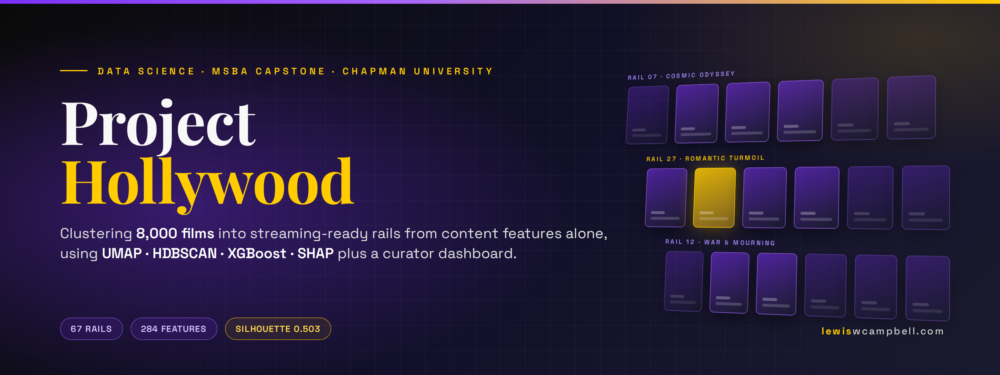
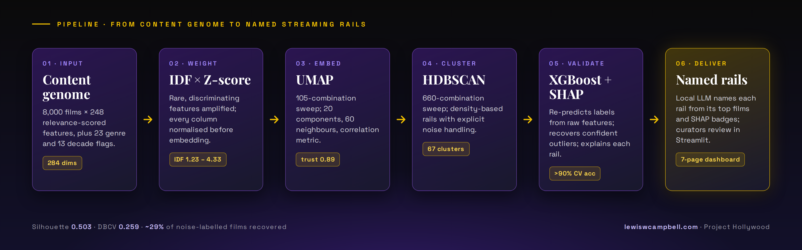

<p align="center">
  
</p>

<p align="center">
  <a href="https://capstone-project-hollywood.streamlit.app/"></a>
  <a href="https://lewiswcampbell.com/blog/movie-rails-capstone.html"></a>
  
  
  
  
  
</p>

<h3 align="center">Can a machine build the rows on a streaming homepage with no viewing data at all?</h3>

<p align="center">
Project Hollywood is my MS Business Analytics capstone at Chapman University: an end-to-end unsupervised learning pipeline that organizes <b>8,000 films</b> into <b>67 coherent, human-readable “rails”</b> using only what the films <i>are</i> (a 248-feature content genome, genres, and eras), then validates, explains, and names every rail automatically, and hands the result to curators through an interactive dashboard.
</p>

<p align="center"><b><a href="https://capstone-project-hollywood.streamlit.app/">Try the live dashboard</a></b>: start with <i>Final Rails</i>, then click into any rail in <i>Cluster Explorer</i>.</p>

<br>

## Why this matters

Streaming platforms live and die by their homepage rows: “Mind-Bending Sci-Fi”, “Gritty Crime Dramas”, “Feel-Good Family Adventures”. Building those rails by hand doesn't scale across a catalog, and the usual alternative (collaborative filtering) needs millions of viewing events a new platform simply doesn't have.

This project shows that **content features alone** can produce rails that are coherent enough to ship, explainable enough to defend to an editorial team, and cheap enough to regenerate whenever the catalog changes.

## Results at a glance

| Metric | Result | What it means |
|---|---|---|
| Films organized | **8,000** | Full catalog, every film assigned or explicitly flagged |
| Rails discovered | **67 parent clusters** (+ sub-rails) | Found automatically; no target count was imposed |
| Cluster quality | **Silhouette 0.503 · DBCV 0.259** | Solid separation for a high-dimensional, overlapping domain |
| Label reproducibility | **>90 % accuracy** (XGBoost, 5-fold CV) | Rails are learnable from raw features, not artifacts of the embedding |
| Outlier recovery | **~29 %** of noise-labelled films reassigned | Confidence-gated recovery instead of a bloated “Other” bucket |
| Hyperparameter search | **105 UMAP × 660 HDBSCAN** configurations | Every core parameter chosen from evidence, not defaults |

## How it works

<p align="center">
  
</p>

**1 · Weight what's rare.** Each of the 248 genome features is scaled by inverse document frequency before z-scoring, so a feature that appears in 3 % of films carries more signal than one that appears in 60 %. Twenty-three genre and thirteen decade one-hot flags are concatenated unweighted, giving a 284-dimension feature space.

**2 · Embed with UMAP.** A 105-combination grid sweep selected 20 components, 60 neighbours, and a correlation metric, the configuration that maximized neighbourhood preservation (0.419) while keeping trustworthiness at ~0.89. Twenty dimensions, not two: the 2-D/3-D projections in the dashboard are for *looking*, the 20-D embedding is for *clustering*.

**3 · Cluster with HDBSCAN.** A 660-combination sweep over `min_cluster_size`, `min_samples`, `cluster_selection_epsilon`, and selection method landed on (15, 3, 0.10, EOM). Density-based clustering was chosen deliberately: it finds the number of rails itself and is honest about films that don't belong anywhere.

**4 · Validate and recover with XGBoost.** A gradient-boosted classifier trained on the *original* features re-predicts the cluster labels. High accuracy means the rails are real structure in the data, not an embedding hallucination. Films HDBSCAN labelled as noise are reassigned when the model is ≥ 50 % confident.

**5 · Explain with SHAP.** TreeExplainer surfaces the 5–8 features that most distinguish each rail (“feature badges”), so a curator can see *why* a film landed where it did.

**6 · Name with an LLM.** Each rail's highest-confidence films, genre mix, and dominant decade are turned into a 2–5 word title and a one-line description. Locally this runs on Ollama (`llama3.2:3b`) with no data leaving the machine; the hosted dashboard uses Hugging Face Inference Providers, and names every rail automatically in the background the first time it starts.

## The curator dashboard

**Live at [capstone-project-hollywood.streamlit.app](https://capstone-project-hollywood.streamlit.app/).** An eight-page Streamlit app for the humans who ship the rails:

| Page | Purpose |
|---|---|
| **Final Rails** | The shippable output: named rails, descriptions, membership, and an exportable film-to-rail mapping |
| **Cluster Explorer** | 2-D/3-D UMAP views, per-rail feature badges, film rails with posters, rename and curate |
| **Film Explorer** | Search any title, see its rail, confidence, genome profile, and nearest neighbours |
| **Outlier Review** | Triage noise-labelled films by outlier score and XGBoost recovery confidence |
| **Data Health** | Coverage, missingness, and taxonomy integrity checks before anything runs |
| **Pipeline Runner** | Re-run any stage with new parameters; every run is logged to `run_history.jsonl` |
| **Experiment Tracker** | Compare sweeps and runs side by side |
| **Rail Naming** | Status of the automatic LLM naming run, with an admin re-run and downloadable name files |

## Quickstart

```bash
git clone https://github.com/LewisWCampbell/Capstone-Project-Hollywood.git
cd Capstone-Project-Hollywood

python -m venv .venv && source .venv/bin/activate     # Windows: .venv\Scripts\activate
pip install -r requirements.txt

# Optional: poster lookups and LLM rail naming
cp "Final Documents/SECRETS.template" "Final Documents/SECRETS"   # add free OMDb and Hugging Face keys, or run Ollama locally

cd "Final Documents/Dashboard"
streamlit run app.py
```

The full pipeline with every experiment and justification lives in **`Final Documents/PROJECT_HOLLYWOOD_FINAL.ipynb`**; the precomputed artifacts the dashboard loads on first launch are in `Final Documents/Dashboard/results/artifacts/`. Poster images are tracked with Git LFS, so run `git lfs pull` if they appear as pointer files.

## Repository map

```
├── Final Documents/
│   ├── PROJECT_HOLLYWOOD_FINAL.ipynb      ← the pipeline, start to finish
│   ├── PROJECT_HOLLYWOOD_EXPERIMENTAL.ipynb
│   ├── Dashboard/                          ← Streamlit app (app.py, pages/, utils/)
│   ├── Data for Pipeline/                  ← genome long-form, taxonomy, genres, metadata
│   ├── Outputs for Dashboard/              ← movie_clusters_final.csv, cluster summaries
│   ├── figures/                            ← UMAP / HDBSCAN sweep justification plots
│   └── Project_HOLLYWOOD_Technical_Doc.docx
├── Old Methodologies/                      ← graph-theory, Laplacian, and PCA approaches that lost
├── Old Dashboards/                         ← earlier dashboard iterations
├── posters/                                ← 7,600+ poster images (Git LFS)
├── imdb_poster_scraper.py · omdb_data_pull.py
└── feature_taxonomy.csv · genre_data.csv · feature_data_longform.csv
```

## A note on the data

The 248-feature content genome was provided for this capstone by an industry partner and is proprietary. To make the repository public, the **feature, category, and sub-category names have been anonymized** to ID-keyed placeholders (`Feature 0440`, `Category 13`, `Subcategory 13.2`) everywhere they appear: data files, notebooks, dashboard artifacts, and derived outputs. Feature IDs, relevance scores, and every stage of the pipeline are unchanged, so results reproduce exactly; only the human-readable labels are withheld. Genre labels, IMDb identifiers, and OMDb-sourced metadata are public data.

## What I'd do next

- **Engagement signals.** The rails are coherent; whether people *click* them is the commercial question. Even light watch-time data would let each rail be scored on relevance, not just cohesion.
- **Stability testing.** Multi-seed UMAP runs to quantify how much rail membership shifts between embeddings.
- **Automated merging.** Per-cluster F1 from the XGBoost validator as a quality gate; rails the model can't tell apart probably shouldn't be separate.
- **Factor analysis as preprocessing.** A latent-structure alternative to IDF weighting that may handle the genome's correlated features more gracefully.

## Team & acknowledgements

Built with my capstone teammates for the **MS in Business Analytics at Chapman University's Argyros College of Business and Economics**. Thanks to our faculty advisor, who also arranged access to the content-genome dataset through an industry partner.

Film metadata and posters courtesy of the [OMDb API](https://www.omdbapi.com/) and [TMDB](https://www.themoviedb.org/). This product uses the TMDB API but is not endorsed or certified by TMDB.

<br>

<p align="center">
  <a href="https://lewiswcampbell.com"></a>
  <a href="https://github.com/LewisWCampbell"></a>
</p>

<p align="center"><sub>Lewis William Campbell · Digital Marketing Strategist &amp; Data Analyst · MS Business Analytics, Chapman University</sub></p>
